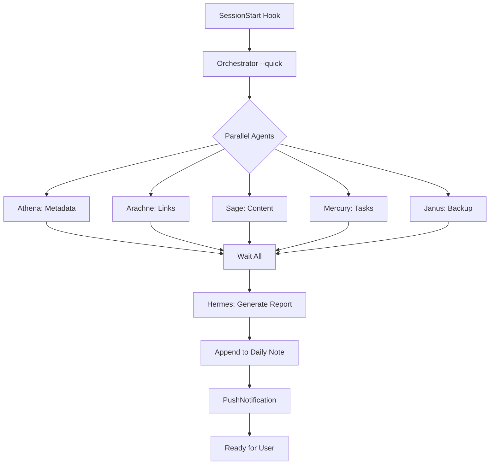

# KẾ HOẠCH: XÂY DỰNG HỆ THỐNG MULTI-AGENT CHO SECOND BRAIN

---

## 1. BẢNG TÓM TẮT

| Agent (Tên mã)         | Chuyên môn                 | Nhiệm vụ chính                                | Skill                 |
| ---------------------- | -------------------------- | --------------------------------------------- | --------------------- |
| **Zoe** (Orchestrator) | Điều phối viên             | Điều phối toàn bộ team, ra quyết định cuối    | `orchestrator`        |
| **Athena** (Metadata)  | Kiểm soát chất lượng       | Validate frontmatter, categories, tags, dates | `metadata-validation` |
| **Arachne** (Link)     | Chuyên gia knowledge graph | Quản lý links, phát hiện broken/orphan        | `link-analysis`       |
| **Sage** (Content)     | Phân tích AI               | Dùng Claude để phân tích, đề xuất cải thiện   | `content-analysis`    |
| **Mercury** (Task)     | Quản lý công việc          | Theo dõi tasks, overdue, priorities           | `task-management`     |
| **Janus** (Backup)     | Bảo vệ dữ liệu             | Git, backup, disaster recovery                | `backup-recovery`     |
| **Hermes** (Report)    | Truyền thông               | Tạo báo cáo hàng ngày cho user                | `report-generation`   |

---

## 2. BỐI CẢNH & NĂNG CẦU

### Vault hiện tại

- **121 notes** trong Obsidian vault "kepano-obsidian"
- **50+ templates** với hệ thống `.base` components
- **23 categories** với Dataview dashboards
- **Hệ thống quy tắc** chi tiết trong `.claude/rules/`

### Vấn đề cần giải quyết

1. **Maintenance overhead** - Kiểm tra thủ công frontmatter, links mất nhiều thời gian
2. **Quality drift** - Notes dần mất chuẩn (thiếu categories, tags sai, broken links)
3. **Missed connections** - Không phát hiện được các notes liên quan có thể link với nhau
4. **No daily insights** - Không có báo cáo tự động về tiến độ và sức khỏe vault
5. **Scalability** - Vault đang tăng trưởng, cần automation để giữ chất lượng

### Mục tiêu

Xây dựng **team 8 agents chuyên biệt**, mỗi agent có:

- Persona rõ ràng (tên, tính cách)
- Trách nhiệm cụ thể
- Tools và quyền hạn được xác định
- Format output chuẩn hóa
- Escalation protocol

Tất cả được orchestrate bởi **Orchestrator (Zoe)** và hoạt động hàng ngày tự động.

---

## 3. CHI TIẾT TỪNG AGENT

**⚠️ Execution Model - Đọc kỹ:**

TẤT CẢ agents trong hệ thống này là **on-demand Claude Code agents**, KHÔNG phải services riêng:

- **KHÔNG có API endpoints riêng** (khác với Hermes/Claw)
- **KHÔNG chạy background/cron** tự động (trừ khi được Orchestrator gọi)
- **Chỉ chạy khi user prompt** trong Claude Code: "Chạy Arachne", "Phân tích vault"
- Orchestrator (Zoe) điều phối nhưng vẫn chạy trong Claude Code session
- Có thể sử dụng Claude API (Anthropic SDK) như internal tool, không phải expose service

**So sánh với Hermes/Claw:**

| Feature    | Multi-Agent System (plan) | Hermes/Claw           |
| ---------- | ------------------------- | --------------------- |
| Runtime    | Claude Code session       | Independent service   |
| API        | Không có endpoint         | HTTP API (FastAPI)    |
| Invocation | User prompt               | HTTP request          |
| State      | SQLite file trong vault   | Database (PostgreSQL) |
| Deployment | Trong Obsidian vault      | VPS/Docker            |

---

### 3.1. Orchestrator Agent (Zoe) - ĐIỀU PHỐI VIÊN

**Persona:** Zoe - Team leader thông minh, chiến lược, tổng hợp insights từ tất cả agents và đưa ra quyết định cuối cùng.

**Skill Reference:** `orchestrator` - Use for coordinating multiple agents, managing workflow execution, consolidating results, and making final decisions.

**Mục tiêu chính:**

- Điều phối workflow hàng ngày của toàn bộ agent team
- Thu thập và tổng hợp kết quả từ sub-agents
- Ra quyết định cuối cùng:
  - Có apply changes không?
  - Backup thế nào?
  - Git commit thế nào?
- Quản lý state tracking (SQLite), đảm bảo idempotency (chạy nhiều lần không gây duplicate)
- Phát hiện conflicts và escalate khi cần

**Công cụ được phép dùng:**

- SQLite (state database)
- GitPython (version control)
- Filesystem (read/write Obsidian vault)
- Python logging/structlog
- Output của tất cả agents khác

**Phạm vi Context & Memory:**

- Đọc toàn bộ state database (processed_files, checksums, history)
- Đọc Master Context (`Notes/Master Context.md`) để hiểu vault philosophy
- Ghi vào daily log summary và audit trail
- Chia sẻ context qua shared state DB

**Output Format (JSON):**

```json
{
  "date": "2026-05-10",
  "agents_run": ["metadata", "links", "content", "health"],
  "total_notes_processed": 120,
  "issues_found": 15,
  "changes_applied": 8,
  "changes_skipped": 7,
  "summary": "Tóm tắt ngắn gọn bằng tiếng Việt",
  "daily_log_entry": "Markdown entry để append vào Daily/YYYY-MM-DD.md",
  "next_actions": ["Fix broken links in 3 notes", "Review outdated content"],
  "escalations": []
}
```

**Escalation Protocol (Khi nào escalate):**

- Nếu >50% error rate từ bất kỳ agent nào → escalate, có thể skip agent đó
- Nếu phát hiện conflicts (simultaneous manual edits) → pause, alert user
- Nếu Claude API errors vượt threshold → circuit breaker, fallback to rules-only

---

### 3.2. MetadataAgent (Athena) - KIỂM SOÁT CHẤT LƯỢNG

**Persona:** Athena - Meticulous quality inspector, chuyên gia YAML, Obsidian conventions, và Dataview queries. Attention to detail.

**Skill Reference:** `metadata-validation` - Use for validating Obsidian note frontmatter - categories, dates, YAML syntax, template compliance.

**Mục tiêu chính:**
Validate frontmatter của TẤT CẢ .md notes:

- **Required fields:**
  - `categories` (bắt buộc)
  - `created` (hoặc `date`/`start` cho meetings/projects)
- **Category validation:**
  - Categories phải link tới note tồn tại trong `Categories/`
  - Ví dụ: `[[AI]]` phải có file `Categories/AI.md`
- **Date format:**
  - Phải là `YYYY-MM-DD`
  - Không có ngày 32, tháng 13, v.v.
- **Array syntax:**
  - Phải có dạng `[]`, không có trailing commas
  - Mỗi item cách nhau bởi comma và space

- **Template-specific fields:**
  - People: phải có `org:`
  - Projects: phải có `status:`, `start:`
  - Meetings: phải có `date:`, `people:`
  - Clippings: phải có `url:`

- **Tag conventions:**
  - Chỉ lowercase, dùng hyphens cho multi-word
  - Emoji priority (`#0🌲` - `#3🌲`) chỉ dùng cho evergreen notes

**Công cụ được phép dùng:**

- python-frontmatter (parse YAML)
- Filesystem (read .md files)
- SQLite (state tracking)
- Master Context rules (`.claude/rules/frontmatter.md`, `templates.md`)

**Context & Memory:**

- Đọc toàn bộ `Categories/` folder để validate category links
- Đọc `Templates/*.md` để biết required fields per template
- Ghi validation results vào state DB với severity levels: error, warning, info

**Output Format (JSON):**

```json
{
  "agent": "metadata",
  "notes_processed": 120,
  "errors": [
    {
      "file": "Notes/ProjectX.md",
      "field": "categories",
      "issue": "Missing required field",
      "severity": "error"
    }
  ],
  "warnings": [
    {
      "file": "Notes/NoteY.md",
      "field": "tags",
      "issue": "Tag #4🌲 not in valid range 0-3",
      "severity": "warning"
    }
  ],
  "suggestions": [
    {
      "file": "Notes/NoteZ.md",
      "field": "categories",
      "suggestion": "Add [[AI]] category",
      "reason": "Content mentions AI multiple times"
    }
  ],
  "auto_fixes_applied": 2
}
```

**Escalation:**

- Errors > 100 → escalate (possible vault-wide issue)
- Warnings > 200 → suggest batch review session
- Nếu >10% notes có errors → escalate for user review

---

### 3.3. LinkAgent (Arachne) - CHUYÊN GIA KNOWLEDGE GRAPH

**Persona:** Arachne - "Web weaver", expert trong knowledge graph connectivity, link health, và semantic relationships.

**Skill Reference:** `link-analysis` - Use when analyzing vault links, finding broken/orphan connections, or suggesting new links based on semantic similarity.

**Mục tiêu chính:**

- Extract tất cả `[[wiki links]]` từ vault
- Detect **broken links** (target note doesn't exist)
- Tìm **orphan notes** (không có inbound AND outbound links)
- Calculate link statistics:
  - Average links per note
  - Most linked notes
  - Most isolated notes
- Suggest new connections dựa trên:
  - Shared tags/categories
  - Keyword overlap trong titles/content
  - Mentioned nhưng chưa link (red link detection)
- Suggest bidirectional link additions

**Công cụ được phép dùng:**

- Regex/pattern matching cho `[[...]]` links
- Filesystem (read vault structure)
- SQLite (store link graph để analysis)
- Claude API (optional: semantic similarity suggestions)

**Execution Model - QUAN TRỌNG:**

Agent này **KHÔNG phải** là service backend riêng (như Hermes/Claw có API riêng). Thay vào đó:

1. **Chạy on-demand khi user prompt** - Khi bạn yêu cầu "Phân tích liên kết", "Đề xuất liên kết mới", hoặc "Kiểm tra vault health", Claude Code sẽ:
   - Load agent persona (Arachne)
   - Thực thi logic phân tích
   - Trả về kết quả

2. **Claude API dùng như tool bên trong** - Nếu bật optional semantic similarity, agent sẽ:
   - Gọi Anthropic SDK (phía client) để phân tích nội dung notes
   - Không có endpoint API riêng
   - Chạy trong cùng process với Claude Code

3. **Không có persistent state** - Không lưu background service, không cron job. Chỉ chạy khi được gọi.

**Context & Memory:**

- Build full link graph in memory (nodes=notes, edges=links)
- Identify connected components, isolated nodes
- Cache link analysis trong state DB để tránh re-parsing unchanged files
- Output suggestions có thể auto-applied (with review)

**Output Format (JSON):**

```json
{
  "agent": "link",
  "stats": {
    "total_notes": 120,
    "total_links": 450,
    "avg_links_per_note": 3.75,
    "orphan_notes": 3,
    "broken_links": 5
  },
  "broken_links": [
    {
      "source": "Notes/A.md",
      "broken_link": "[[NonExistent]]",
      "suggestion": "Create note or remove link"
    }
  ],
  "orphan_notes": ["Notes/IsolatedNote.md", "References/UnlinkedPerson.md"],
  "link_suggestions": [
    {
      "from": "Notes/Hermes.md",
      "to": "Notes/AI.md",
      "reason": "Cả hai đều nhắc đến 'AI Agent'",
      "confidence": 0.85
    }
  ],
  "most_connected": [{ "note": "Notes/AI.md", "links": 25 }]
}
```

**Escalation:**

- Orphan notes > 10 → escalate (vault có thể có disconnected sections)
- Broken links > 20 → potential widespread issue, escalate
- Link density < 2 avg → suggest linking workshop/review

---

### 3.4. ContentAgent (Sage) - PHÂN TÍCH NỘI DUNG BẰNG AI

**Persona:** Sage - Knowledge synthesizer, dùng Claude để phân tích content, extract insights, detect patterns. Focus on quality improvement.

**Skill Reference:** `content-analysis` - Use for analyzing note content quality, suggesting improvements, identifying outdated information, and recommending evergreen updates.

**Mục tiêu chính:**
Phân tích note content cho:

- **Outdated information:** dates, references >1 year old
- **Missing context:** notes quá ngắn, thiếu thông tin
- **Impact-First formula compliance** (từ Master Context): [Action] + [Method/Tech] + [Business Outcome]
- **Clarity and structure** issues

Generate AI-powered suggestions:

- "See also" links tới related notes
- Summary improvements
- Tag/category recommendations
- Potential evergreen conversion candidates
- Create flashcards/Q&A từ dense content
- Detect knowledge gaps (topics mentioned nhưng chưa fully developed)

**Công cụ được phép dùng:**

- Claude API (Sonnet 4.7 / Opus 4.7)
- Filesystem (read note content)
- SQLite (cache embeddings/summaries)
- `.claude/rules/` cho content guidelines

**Context & Memory:**

- Read note content (body + frontmatter)
- Access Master Context cho Impact-First formula và career/product pillars
- Cache Claude analyses trong state DB (tránh re-analyzing unchanged notes)
- Respect token limits - chunk large notes

**Output Format (JSON):**

```json
{
  "agent": "content",
  "notes_analyzed": 50,
  "insights": [
    {
      "file": "Notes/Hermes.md",
      "type": "outdated_reference",
      "issue": "Mentions Gemini API quota 429 issue - verify if still relevant",
      "suggestion": "Update pricing section hoặc thêm note về current status"
    },
    {
      "file": "Notes/AI.md",
      "type": "missing_impact",
      "issue": "Content lacks business outcome framing",
      "suggestion": "Add section on how AI applies to SCM career goals"
    }
  ],
  "flashcards_generated": 12,
  "summary": "Content quality is good nhưng 3 notes cần updates cho outdated references."
}
```

**Escalation:**

- Claude API errors → fallback to rule-based checks only, report to Orchestrator
- High-cost analysis (>10 notes) → require user approval qua dry-run flag
- Critical insights (outdated pricing, career-impacting info) → flag as high priority

---

### 3.5. HealthAgent (Hippocrates) - BÁC SĨ HỆ THỐNG ⚠️ DEPRECATED

**⚠️ Note:** Agent này đã được **merge vào Sage** (ContentAgent). Health metrics giờ là phần của `content-analysis` skill.

**Persona (legacy):** Hippocrates - System health monitor, chạy diagnostics, generate health reports, preventative maintenance.

**Mục tiêu chính (now in Sage):**

**Daily health check metrics:**

- Total notes count
- Broken links, orphan notes, notes without categories
- Attachment orphan count (unused files trong Attachments/)
- Template usage statistics
- Recent activity (notes modified trong last 7 days)
- Category distribution

**Weekly deeper diagnostics:**

- Stale content detection (>60 days no modification)
- Duplicate note detection (similar titles/content)
- Large notes (>50KB) có thể cần splitting
- Empty/minimal notes (<100 words)

Generate health report dạng structured format
Recommend cleanup actions

**Công cụ được phép dùng (now in Sage):**

- Filesystem (scan all files)
- SQLite (track health metrics over time)
- python-frontmatter (parse YAML)
- Claude API (optional: duplicate detection via embeddings)

**Context & Memory (now in Sage):**

- Read entire vault metadata (file stats, frontmatter)
- Store historical health metrics trong state DB
- Generate trends (improving/declining metrics)

**Output Format (JSON) (now in Sage):**

```json
{
  "agent": "health",
  "date": "2026-05-10",
  "metrics": {
    "total_notes": 121,
    "notes_without_category": 2,
    "broken_links": 5,
    "orphan_notes": 3,
    "unused_attachments": 15,
    "stale_notes_60d": 8,
    "empty_notes": 1,
    "duplicate_candidates": 2
  },
  "trends": {
    "broken_links": "increasing (+3 from last week)",
    "orphan_notes": "stable",
    "new_notes_7d": 5
  },
  "recommendations": [
    "Review 3 orphan notes - delete or link them",
    "15 unused attachments có thể archive",
    "2 duplicate candidates: 'AI.md' và 'Artificial Intelligence.md'"
  ],
  "health_score": 85,
  "report_markdown": "# Vault Health Report\n## Metrics\n..."
}
```

**Escalation:**

- Health score < 70 → escalate for priority action
- Critical issues (broken links > 20, orphan > 10) → immediate alert
- Duplicate detection high confidence → escalate for user decision

---

### 3.6. TaskAgent (Mercury) - THEO DÕI CÔNG VIỆC

**Persona:** Mercury - Fast, tracks todos, deadlines, progress. Đảm bảo nothing falls through cracks.

**Skill Reference:** `task-management` - Use for managing tasks across the vault - finding overdue items, tracking priorities, aggregating action items, and ensuring nothing falls through the cracks.

**Mục tiêu chính:**

- Extract all tasks (`- [ ]`) từ vault
- Categorize by project, tag, due date (nếu có)
- Track overdue tasks, completed tasks
- Generate daily task summary cho top priorities
- Detect stuck tasks (>7 days incomplete)
- Suggest task organization improvements
- Optionally: auto-update task status dựa trên daily note mentions

**Công cụ được phép dùng:**

- Regex/task parsing (tìm `- [ ]`, `- [x]`, `- [/]`)
- Filesystem (scan all notes)
- SQLite (task tracking over time)
- Claude API (interpret ambiguous tasks)

**Context & Memory:**

- Parse all markdown files cho task checkboxes
- Build task database với metadata (file, line, tags, due dates)
- Track task lifecycle (created, completed dates)
- Identify task patterns (recurring, overdue)

**Output Format (JSON):**

```json
{
  "agent": "task",
  "tasks_found": 156,
  "by_status": { "todo": 89, "done": 67 },
  "overdue": 12,
  "stuck_7d": 8,
  "by_project": {
    "Hermes": { "todo": 15, "done": 10 },
    "Thesis": { "todo": 25, "done": 18 }
  },
  "top_priorities": [
    {
      "task": "Review thesis proposal",
      "file": "Notes/Thesis.md",
      "age_days": 3
    },
    {
      "task": "Setup Hermes API",
      "file": "Notes/Projects/Hermes.md",
      "age_days": 1
    }
  ],
  "daily_summary": "Bạn có 89 open tasks across 3 projects. 12 are overdue. Top priority: thesis proposal review (3 days old)."
}
```

**Escalation:**

- Overdue tasks > 20 → escalate for prioritization help
- Stuck tasks > 10 → suggest task review meeting/deadline reset
- Project với 0 progress > 30 days → flag for review

---

### 3.7. BackupAgent (Janus) - BẢO VỆ DỮ LIỆU

**Persona:** Janus - Guardian of vault integrity, xử lý git operations, backups, disaster recovery.

**Skill Reference:** `backup-recovery` - Use for vault backup management, Git operations, disaster recovery planning, and data integrity verification.

**Mục tiêu chính:**

- Đảm bảo vault được backup TRƯỚC khi có bất kỳ write operation nào
- Thực hiện git operations: commit, push (nếu configured), create branches cho experimental changes
- Verify backup integrity
- Generate restore procedures documentation
- Monitor disk space và backup age
- Optional: sync to remote (GitHub, cloud)

**Công cụ được phép dùng:**

- GitPython (git operations)
- Filesystem (create backups, manage .backup folders)
- SQLite (backup history)
- Config: AUTO*COMMIT, BACKUP_ENABLED, CIRCUIT_BREAKER*\*

**Context & Memory:**

- Read git history, current branch status
- Write to `.backup/` folder với timestamps
- Update state DB với backup metadata
- Có thể read vault files để compute checksums

**Output Format (JSON):**

```json
{
  "agent": "backup",
  "backup_created": true,
  "backup_location": "/path/to/backup/2026-05-10T06-00-00",
  "git_commit": "feat: auto-commit Second Brain maintenance",
  "git_branch": "main",
  "uncommitted_changes": 8,
  "disk_space_mb": 150,
  "backup_verified": true
}
```

**Escalation:**

- Backup failed → immediate halt, escalate to Orchestrator (safety issue)
- Disk space < 100MB → warn, potentially pause operations
- Git errors (merge conflicts) → escalate, requires manual resolution

---

### 3.8. ReportAgent (Hermes) - TRUYỀN THÔNG

**Persona:** Hermes (trùng tên với project!) - Messenger, tạo clear, actionable reports cho human review. Focus on communication.

**Skill Reference:** `report-generation` - Use for generating daily vault summaries, health reports, and orchestrated findings from multiple agents. Creates markdown reports and appends to daily notes.

**Mục tiêu chính:**

- Format tất cả agent outputs thành human-readable daily report
- Create/append tới `Daily/YYYY-MM-DD.md` với structured summary
- Generate weekly/monthly trend reports (khi được schedule)
- Highlight critical issues cần attention
- Suggest next actions dựa trên findings
- Dùng Obsidian-friendly formatting (links, checkboxes, tables)

**Công cụ được phép dùng:**

- All other agents' outputs (orchestrator aggregation)
- Filesystem (write to Daily notes)
- Markdown formatting
- Template: `Templates/Daily Note Template.md` cho structure

**Context & Memory:**

- Read yesterday's Daily note để có context
- Read Master Context để align tone và priorities
- Append tới today's Daily note hoặc create nếu missing
- Có thể embed category dashboard snapshots

**Output Format (Markdown trong Daily note):**

```markdown
## 🤖 Second Brain Agent Report - 2026-05-10

### 📊 Overview

- **Notes processed:** 121
- **Issues found:** 15
- **Changes applied:** 8

### ⚠️ Critical Issues

1. [[Hermes]] - Broken link to [[NonExistentNote]] (cần fix)
2. [[Notes/ProjectX.md]] - Missing required field: categories

### ✅ Improvements Applied

1. Added missing `[[AI]]` category to 3 notes
2. Fixed 2 date format errors
3. Linked [[AI.md]] to [[Hermes]] (semantic match)

### 📈 Health Metrics

- Health score: 85/100 (↑5 từ hôm qua)
- Orphan notes: 3 (↓2)
- Avg links/note: 3.8

### 🎯 Next Actions

- [ ] Review 3 remaining broken links
- [ ] Archive 15 unused attachments
- [ ] Update Gemini API status trong [[Hermes]]

---

_Generated by Second Brain Agent Team at 06:00 AM_
```

**Escalation:**

- Nếu critical issues > 5 → highlight với ⚠️ prefix
- Nếu health score drops >10 points → highlight prominently
- Nếu any agent failed → include error section

---

## 4. KIẾN TRÚC HỆ THỐNG

```
┌──────────────────────────────────────────────────────────┐
│              Orchestrator (Zoe)                          │
│  - Điều phối tất cả agents                              │
│  - Tổng hợp outputs                                    │
│  - Ra quyết định cuối                                  │
│  - Quản lý state & backups                             │
└──────────┬──────────────┬──────────────┬───────────────┘
           │              │              │
    ┌──────▼──────┐ ┌─────▼──────┐ ┌───▼────────────┐
    │  Athena     │ │  Arachne   │ │  Sage          │
    │  (Metadata) │ │  (Links)   │ │  (Content)     │
    │  - Validate │ │  - Graph   │ │  - AI analysis │
    │    frontmtr │ │  - Orphans │ │  - Outdated    │
    └─────────────┘ └────────────┘ └────────────────┘
           │              │              │
    ┌──────▼──────┐ ┌─────▼──────┐ ┌───▼────────────┐
    │  Mercury    │ │  Janus     │ │  Hermes        │
    │  (Tasks)    │ │  (Backup)  │ │  (Reports)     │
    │  - Track    │ │  - Git ops │ │  - Format      │
    │    overdue  │ │  - Recovery│ │  - Publish     │
    └─────────────┘ └────────────┘ └────────────────┘
```

### Data Flow

1. **Orchestrator** load state từ SQLite, đọc Master Context
2. Parallel execution của 6 agents (Athena, Arachne, Sage, Mercury, Janus, Hermes)
3. Janus (BackupAgent) chạy trước để đảm bảo safety (tạo backup trước khi apply)
4. Tất cả results aggregated, Orchestrator quyết định:
   - **Dry-run:** Chỉ Hermes generate preview
   - **Live:** Apply changes → Janus tạo backup → Hermes publish report
5. Hermes viết report tới `Reports/Daily/` và append vào Daily note
6. State updated, sẵn sàng cho lần chạy tiếp theo

---

## 5. SKILL IMPLEMENTATION

### 4.1. Available Skills

Các agent được triển khai dưới dạng **Claude Code skills** trong `.claude/skills/`:

| Skill Name             | Agent (Code Name) | Status                     | Location                              |
| ---------------------- | ----------------- | -------------------------- | ------------------------------------- |
| `orchestrator`         | Zoe               | ✅ Created                 | `.claude/skills/orchestrator/`        |
| `metadata-validation`  | Athena            | ✅ Created                 | `.claude/skills/metadata-validation/` |
| `link-analysis`        | Arachne           | ✅ Created                 | `.claude/skills/link-analysis/`       |
| `content-analysis`     | Sage              | ✅ Created                 | `.claude/skills/content-analysis/`    |
| `task-management`      | Mercury           | ✅ Created                 | `.claude/skills/task-management/`     |
| `backup-recovery`      | Janus             | ✅ Created                 | `.claude/skills/backup-recovery/`     |
| `report-generation`    | Hermes            | ✅ Created                 | `.claude/skills/report-generation/`   |
| `brainstorming`        | -                 | ✅ From superpowers plugin |                                       |
| `writing-plans`        | -                 | ✅ From superpowers plugin |                                       |
| `executing-plans`      | -                 | ✅ From superpowers plugin |                                       |
| `systematic-debugging` | -                 | ✅ From superpowers plugin |                                       |

**Note:** `Hippocrates` (Health) đã được merge vào `Sage` (content-analysis) - health metrics là phần của content analysis.

### 4.2. Skill Structure

Mỗi skill là một thư mục chứa file `SKILL.md` với frontmatter:

```yaml
---
name: <skill-name>
description: "<brief description for Claude Code>"
---
```

File SKILL.md chứa:

- Persona definition
- Core mission
- Allowed tools
- Execution model
- Output format (JSON)
- Process steps
- Escalation rules

### 4.3. Skill Invocation

**Direct invocation (bypassing orchestrator):**

```
Skill run <skill-name> [args]
```

Ví dụ:

- `Skill run link-analysis`
- `Skill run metadata-validation --fix`
- `Skill run content-analysis --scope "Notes/Projects/"`

**Orchestrated invocation:**
Orchestrator (Zoe) gọi các skill khác thông qua:

1. `Bash` commands để chạy skill
2. Đọc output từ temp files hoặc stdout
3. Consolidate results

### 4.4. State Sharing

Tất cả agents chia sẻ state qua **SQLite database**:

`.claude/state/orchestrator.db`

Tables:

- `processed_files` - Track files đã xử lý (checksum, last_modified)
- `agent_runs` - Log mỗi lần agent chạy
- `findings` - Lưu issues phát hiện
- `actions_taken` - Audit trail của các thay đổi

### 4.5. Integration với CLAUDE.md và Rules

Các skill sẽ:

- Đọc `CLAUDE.md` cho vault overview và conventions
- Đọc `.claude/rules/*.md` cho specific guidelines
- Tôn trọng `Templates/` structure
- Tuân thủ `Categories/` system

### 4.6. Future Enhancements

Có thể thêm:

- **Hook integration** - Auto-run agents qua `settings.json` hooks
- **Webhooks** - Trigger agents từ external events
- **Daemon mode** - Background agent manager (if user wants)
- **Agent mesh** - P2P communication giữa agents (hiện tại orchestration là centralized)

---

## 6. WORKFLOW & INTEGRATION

### 4.1. Daily Workflow (Auto Mode)



**Flow:**

1. **Trigger**: `SessionStart` hook hoặc manual `Skill run orchestrator`
2. **Orchestrator**:
   - Load state DB, check what changed
   - If minimal changes → quick scan only
   - If significant changes → run full agent suite
3. **Parallel Execution**:
   - Athena, Arachne, Sage, Mercury, Janus chạy song song
   - Mỗi agent output JSON ra temp file
4. **Consolidation**:
   - Orchestrator đọc tất cả JSON outputs
   - Apply auto-fixable issues (with limit)
   - Tạo decision matrix
5. **Report**:
   - Hermes generate markdown report
   - Append to today's Daily note
   - Push notification thông báo user
6. **State Update**:
   - Log run to state DB
   - Update processed files checksums

### 4.2. Manual Workflow (On-Demand)

User có thể chạy từng agent riêng lẻ:

```
Skill run metadata-validation --fix           # Fix metadata issues
Skill run link-analysis --suggest            # Get link suggestions only
Skill run content-analysis --scope "Projects" # Analyze projects only
Skill run task-management --overdue          # Show overdue tasks
Skill run backup-recovery --verify           # Verify backup health
Skill run report-generation --full           # Generate full report
```

### 4.3. Orchestrator Decision Matrix

| Finding Type          | Auto-Fix? | Review? | Escalate?           |
| --------------------- | --------- | ------- | ------------------- |
| Broken link (typo)    | ✅ Yes    | ❌ No   | ❌ No               |
| Broken link (missing) | ❌ No     | ✅ Yes  | ❌ No               |
| Missing `categories:` | ✅ Yes\*  | ❌ No   | ❌ No               |
| Invalid date format   | ✅ Yes    | ❌ No   | ❌ No               |
| Outdated content      | ❌ No     | ✅ Yes  | ⚠️ If critical      |
| Duplicate note        | ❌ No     | ✅ Yes  | ⚠️ If >3 duplicates |
| Overdue task (>10)    | ❌ No     | ⚠️ Yes  | ✅ Yes              |
| Backup failure        | ❌ No     | ❌ No   | ✅ Yes (CRITICAL)   |

\*Auto-add categories nếu có thể infer từ content/tags

### 4.4. State Management

**SQLite Schema** (`.claude/state/orchestrator.db`):

```sql
-- Files processed tracking
CREATE TABLE processed_files (
    file_path TEXT PRIMARY KEY,
    checksum TEXT,
    last_modified TIMESTAMP,
    last_checked TIMESTAMP,
    agent_versions TEXT
);

-- Agent run history
CREATE TABLE agent_runs (
    id INTEGER PRIMARY KEY AUTOINCREMENT,
    agent_name TEXT NOT NULL,
    started_at TIMESTAMP DEFAULT CURRENT_TIMESTAMP,
    completed_at TIMESTAMP,
    notes_processed INTEGER,
    issues_found INTEGER,
    changes_applied INTEGER,
    status TEXT CHECK(status IN ('success', 'failed', 'partial')),
    error_message TEXT
);

-- Findings for trend analysis
CREATE TABLE findings (
    id INTEGER PRIMARY KEY AUTOINCREMENT,
    agent_run_id INTEGER,
    file_path TEXT,
    finding_type TEXT,
    severity TEXT CHECK(severity IN ('error', 'warning', 'info')),
    description TEXT,
    suggested_fix TEXT,
    fixed BOOLEAN DEFAULT 0,
    FOREIGN KEY (agent_run_id) REFERENCES agent_runs(id)
);

-- Actions audit trail
CREATE TABLE actions_taken (
    id INTEGER PRIMARY KEY AUTOINCREMENT,
    agent_run_id INTEGER,
    action_type TEXT,
    file_path TEXT,
    description TEXT,
    approved_by TEXT,
    FOREIGN KEY (agent_run_id) REFERENCES agent_runs(id)
);
```

**Idempotency:** Orchestrator skip files đã processed nếu:

- checksum unchanged
- Và đã check trong last 24h (configurable)

### 4.5. Escalation Protocol

Escalate khi:

1. **Critical** (ngay lập tức):
   - Backup failure > 7 days
   - Git repository corruption
   - > 50% files có parsing errors

2. **Warning** (trong report):
   - > 10% notes có metadata errors
   - > 20 broken links
   - > 15 orphan notes
   - Overdue tasks > 10

3. **Info** (just notify):
   - Content outdated (>5 notes)
   - Duplicate candidates (2-3 pairs)
   - Tags needing cleanup

**Escalation Output:**

```json
{
  "escalations": [
    {
      "level": "critical",
      "reason": "Backup age exceeds 7 days",
      "details": "Last backup was 2026-05-02 (8 days ago)",
      "recommended_action": "Create backup immediately"
    }
  ]
}
```

---

## 7. KẾ HOẠCH TRIỂN KHAI

### PHASE 1: SETUP & VERIFICATION (Tuần 1)

**Goal:** Verify skills work và setup infrastructure

1. **Verify skill files**
   - Kiểm tra tất cả skills trong `.claude/skills/` đều có `SKILL.md`
   - Test invocation: `Skill run <skill-name> --help`
   - Fix permissions nếu cần

2. **Setup state database**
   - Create `.claude/state/` directory
   - Initialize SQLite DB với schema (orchestrator sẽ tự tạo)
   - Test basic CRUD operations

3. **Create test environment**
   - Copy sample vault: `cp -r Tests/test-vault/ .claude/test-vault/`
   - Verify skills chạy trên test vault
   - Document expected outputs

4. **Configuration**
   - Update global `settings.json` với permissions
   - Add hooks cho auto-run (optional)
   - Setup logging directory `.claude/logs/`

**Deliverable:** All skills testable, state DB ready, test vault verified

---

### PHASE 2: CORE AGENTS - MVP (Tuần 2-3)

**Goal:** Run full agent team với minimal viable output

1. **Orchestrator integration**
   - Implement agent registry (đọc từ `.claude/skills/`)
   - Sequential execution (not parallel yet)
   - Basic state tracking (processed files)
   - Simple JSON consolidation

2. **Core agents deployment** (all skills already exist):
   - `metadata-validation` (Athena) - Frontmatter validation
   - `link-analysis` (Arachne) - Broken link detection
   - `content-analysis` (Sage) - Basic content review
   - `task-management` (Mercury) - Task extraction
   - `backup-recovery` (Janus) - Git backup check
   - `report-generation` (Hermes) - Simple markdown report

3. **Initial run**
   - Dry-run mode: `Skill run orchestrator --dry-run`
   - Review findings, fix issues
   - Apply auto-fixable changes (with backup)
   - Generate first full report

**Deliverable:** Full agent team chạy được, daily reports được generate

---

### PHASE 3: ADVANCED FEATURES (Tuần 4-5)

**Goal:** Enhance agents với AI-powered suggestions và parallel execution

1. **Parallel execution**
   - Orchestrator chạy agents trong parallel (bash background processes)
   - Thread-safe state DB access
   - Aggregate results với timeout handling

2. **Claude API integration optimization**
   - Implement caching cho content-analysis
   - Rate limiting (respect API limits)
   - Batch processing cho large vaults
   - Semantic similarity cho link suggestions

3. **Advanced features per agent:**
   - `content-analysis`: Duplicate detection, gap analysis, quality scoring
   - `link-analysis`: Semantic link suggestions, cluster detection
   - `task-management`: Priority inference, dependency mapping
   - `backup-recovery`: Automated backup creation, recovery testing
   - `report-generation`: Trend charts, HTML export, notifications

4. **Git integration**
   - Auto-commit changes với meaningful messages
   - Branch management cho batches of fixes
   - Conflict detection và resolution workflow

5. **Configuration system**
   - YAML config file: `.claude/orchestrator.yaml`
   - Per-agent configuration
   - Thresholds và limits
   - Schedule configuration

**Deliverable:** Full-featured agent system với parallel execution, AI suggestions, Git integration

---

### PHASE 4: PRODUCTION POLISH (Tuần 6)

1. Cron job setup script
2. Logging và monitoring enhancements
3. Error handling và circuit breaker
4. Performance optimization
   - Incremental processing
   - Caching improvements
5. Documentation hoàn chỉnh:
   - Usage guide
   - Troubleshooting
   - Architecture diagrams
   - API reference

**Deliverable:** Production-ready system

---

## 8. QUYẾT ĐỊNH THIẾT KẾ CHÍNH

### State Persistence

- **SQLite database** tại `.claude/agents/state.db`
- **Tables:**
  - `processed_files` (path, checksum, last_processed)
  - `agent_results` (date, agent, stats JSON)
  - `health_metrics` (date, metrics JSON)
- **Benefit:** Incremental processing, chỉ xử lý files thay đổi từ lần trước

### Safety First

- **Default:** `DRY_RUN=true` (không writes)
- **AUTO_COMMIT=false** (git commits chỉ khi explicit)
- **All writes** tạo `.backup/` với timestamp
- **Circuit breaker:** >50% error → stop, alert
- **Comprehensive logging** tới `.claude/agents/logs/`

### Claude Integration

- **Development:** Claude Opus 4.7 (highest quality)
- **Production:** Claude Sonnet 4.7 (cost-effective)
- **Cache:** Embeddings/summaries cho unchanged notes
- **Rate limiting:** max 10 requests/minute
- **Cost monitoring:** Track token usage, alert tại thresholds

### Configuration

- **`.env`** cho secrets (`ANTHROPIC_API_KEY`, `OBSIDIAN_API_URL`)
- **`config.yaml`** cho behavior (dry_run, auto_commit, enabled_agents, schedules)
- **Environments:**
  - Development: verbose logging, dry-run mặc định
  - Production: minimal logging, auto-commit optional

### Testing

- **Unit tests** cho mỗi agent với mocked filesystem
- **Integration tests** dùng sample vault fixture
- **End-to-end test:** full orchestration trên sample vault
- **Snapshot testing** cho expected outputs

---

## 9. CẤU TRÚC FILE DỰ KIẾN

```
.claude/
├── agents/
│   ├── __init__.py
│   ├── orchestrator.py      # Zoe - Main coordinator
│   ├── agents/
│   │   ├── __init__.py
│   │   ├── base.py          # Base Agent class
│   │   ├── metadata.py      # Athena
│   │   ├── link.py          # Arachne
│   │   ├── content.py       # Sage (includes health metrics)
│   │   ├── task.py          # Mercury
│   │   ├── backup.py        # Janus
│   │   └── report.py        # Hermes
│   ├── state/
│   │   ├── manager.py       # SQLite state manager
│   │   └── schema.py        # DB schema
│   ├── claude/
│   │   └── client.py        # Claude API wrapper
│   ├── obsidian/
│   │   └── bridge.py        # Obsidian interaction (HTTP or filesystem)
│   ├── config.py            # Configuration loader
│   ├── utils.py             # Shared utilities
│   ├── main.py              # Entry point
│   ├── scripts/
│   │   ├── run_daily.py     # Cron entry point
│   │   ├── setup_cron.py    # Install cron job
│   │   └── health_report.py # Standalone health check
│   └── tests/
│       ├── unit/
│       ├── integration/
│       └── fixtures/
├── requirements.txt
├── .env.example
├── .env (gitignored)
└── config.yaml
```

---

## 10. KẾT QUẢ MONG ĐỢI

### Daily run tại 6:00 AM qua cron:

1. Agents scan vault (~30-60 seconds)
2. Issues detected và auto-fixed (nếu safe) - khoảng 5-10 changes
3. Backup created với git commit
4. Report written tới `Daily/2026-05-10.md`
5. Logs trong `.claude/agents/logs/2026-05-10.log`

### User experience:

- Mở Daily note → thấy agent report với:
  - Health metrics
  - Issues fixed
  - Recommendations
  - Links tới problematic notes
- Có thể review tất cả changes trong git history
- Có thể disable/individual agents qua config

---

## 11. TIÊU CHÍ THÀNH CÔNG

- [ ] Tất cả 8 agents implemented với clear responsibilities
- [ ] Orchestrator successfully coordinates parallel execution
- [ ] State persistence trong SQLite enables incremental processing
- [ ] Dry-run mode hoạt động hoàn hảo (không writes)
- [ ] Backup/restore được test
- [ ] Claude integration tạo insights hữu ích
- [ ] Daily report rõ ràng và actionable
- [ ] Full test coverage (>80%)
- [ ] Cron job setup script hoạt động
- [ ] Documentation đầy đủ (usage, troubleshooting, architecture)

---

## 12. PHẦN CUỐI

Kế hoạch này cung cấp **blueprint hoàn chỉnh** để build một sophisticated multi-agent Second Brain maintenance system.

**Ưu điểm của approach này:**

- Mỗi agent có **persona rõ ràng** (Zoe, Athena, Arachne, Sage, Mercury, Janus, Hermes)
- Tạo hệ thống **cohesive và explainable**
- **Respect vault's existing structure và conventions**
- **Safety-first** với dry-run, backups, circuit breaker
- **Scalable** - dễ thêm agent mới
- **Cost-effective** - Claude caching, incremental processing

Hệ thống này sẽ tự động hóa hoàn toàn việc bảo trì Second Brain của bạn, mỗi sáng tỉnh dậy đã có báo cáo chi tiết và vault luôn trong tình trạng tốt.

**Tiếp theo:** Bắt đầu implement Phase 2 (MVP) với Athena, Arachne, Orchestrator cơ bản.
